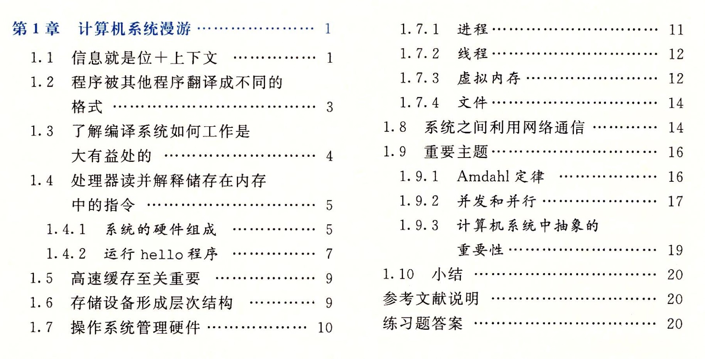
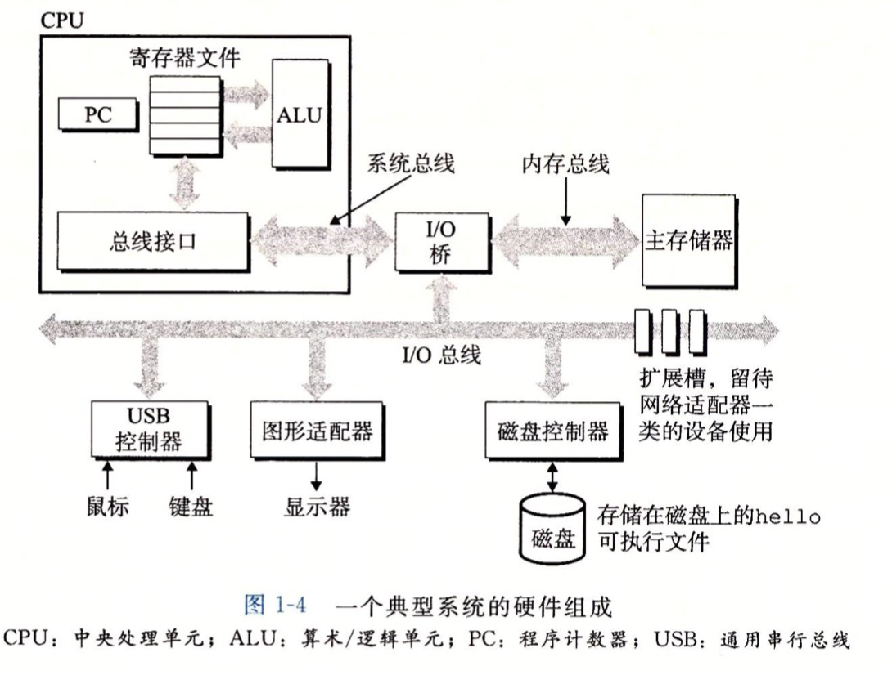
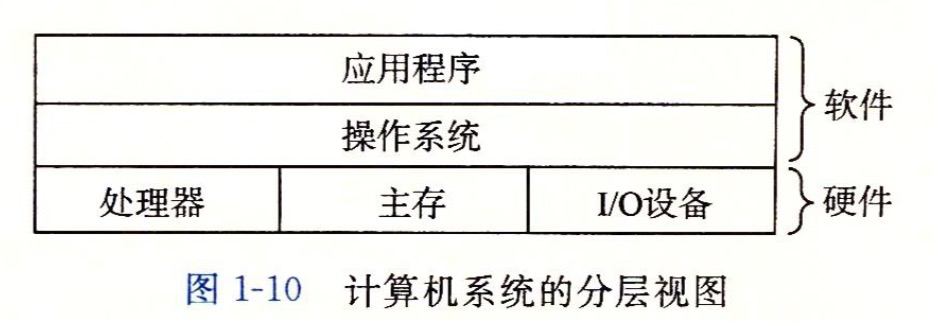
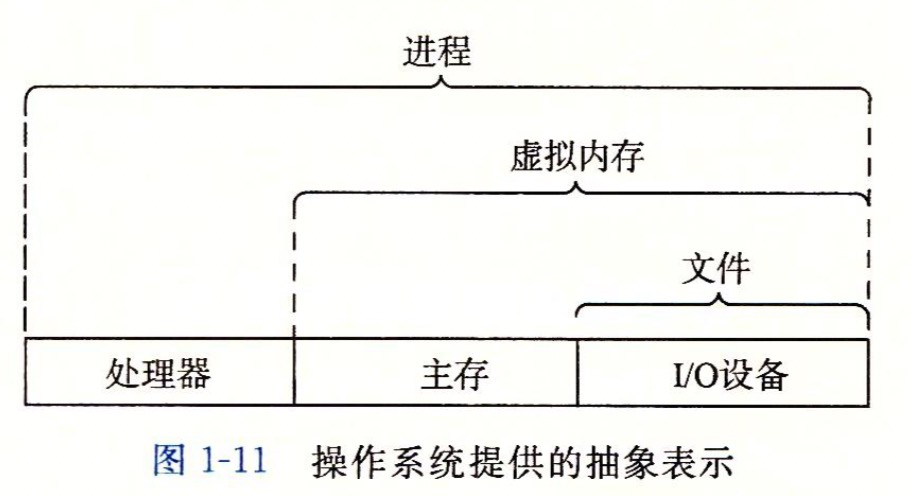

### 计算机系统漫游

#### 目录

### 1.1 信息就是位+上下文

* ##### 源程序就是 0和1 组成的，每个单位叫做“位" 或者“比特”；

* ##### 每个字节由 8个bit 组成；

* ##### ASCII 码是由唯一个单字节组成（*ASCII 码组成的叫文本文件件，其他的叫二进制文件*）

  ### 

### 1.2程序被其他程序翻译成不同的格式化

* ##### 文本程序 到可执行程序的整个历程（如下图所示）

* ###### 负责的是编译器驱动程序

###### 

### 1.3 了解编译系统如何工作的益处

* ##### 优化程序（if 和 switch哪一个高效）

* ##### 理解链接时出现的错误（很多程下序错误与之有关）

* ##### 避免安全漏洞（安全编程的第一步是理解数据和控制信息存储在程序栈上的方式会引起的后果）

### 1.4系统硬件的组成

* #####  运算器、控制器、存储器、输入设备和输出设备这五大基本组件

* ##### 运行一个hello world 的程序流程

  > 1.shell 指令会将字符 读入到寄存器，再放到内存
  >
  > 2.敲击回车，shell 程序会让cpu 执行指令来加载 hello world 的可执行文件到主存
  >
  > 3.处理器开始执行 hello 可执行文件中 mai n 中机器语言指令
  >
  > 4.“hello world !\n ” 字符串从寄存器 复制到 输出设备

### 1.5 高速缓存至关重要

> 随着半导体技术的发展，处理器与主存之间的差距还在增大。加快处理器的运行速度要比加快主存的运行速度 容易而且便宜得多。

* ##### 处理器从磁盘读取数据 要比在主存中读取数据 开销大 1000 万倍

* ##### 处理器从寄存器读取数据要比在主存中读取数据 快100 倍

* ##### 寄存器存放的信息远远小于主存的存储

### 1.6 储存设备形成的层次结构

> 其实这里就是 在处理器和较大的主存 中间 加个 高速缓存的设备

### 1.7 操作系统管理硬件~~~~~~~~

* ##### 操作系统的两个基本功能

  * ###### 防止硬件被失控的程序滥用

  * ###### 向应用程序提供简单操作硬件的的调用机制

* ##### 进程：操作系统对正在运行程序的一种抽象（独立上下文）

* ##### 线程：进程中的一个执行单元（共享上下文）

* ##### 虚拟内存：为每个进程提供一个假象，每个进程独立占用使用的内存。

  

  * ###### 程序代码和数据：直接按照可执行目标文件的内容初始化的，比如可执行的 hello 文件。

  * ###### 堆：调用 malloc 和free 这样的函数，我的理解就是 函数内部的 可伸缩的内存操作空间叫做堆。

  * ###### 共享库：一块用来存放C 标准库和数学库的区域。

  * ###### 栈：用户栈。编译器用来实现函数的调用，我们没调用一个函数 栈就会增长，函数返回栈就会收缩。

###  1.9 并发和并行

* ##### 并发： 不同的代码片段在 一个处理器上 来回切换执行。

* ##### 并行： 不同的代码片段在 不同的处理器上 同时执行。

